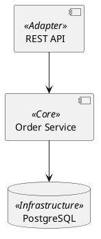

# ❓ Часто задаваемые вопросы (FAQ)

## 📋 Оглавление

- [Общие вопросы](#общие-вопросы)
- [Инструменты MCP](#инструменты-mcp)
- [Качество изображений](#качество-изображений)
- [PlantUML темы](#plantuml-темы)
- [Стереотипы](#стереотипы)
- [Производительность](#производительность)

---

## Общие вопросы

### ❓ Что такое Code to Image MCP?

MCP (Model Context Protocol) сервер для создания высококачественных **скриншотов кода** и **UML диаграмм**. Работает с AI-ассистентами (Cline, Claude Desktop) для автоматизации визуализации кода и архитектуры.

**Основные возможности:**

- Скриншоты кода с подсветкой синтаксиса (Python, JS, SQL и др.)
- PlantUML диаграммы с кастомными темами
- Извлечение конкретных функций/классов из больших файлов
- Высокое качество изображений (до 5x scale_factor)

### ❓ Какие требования для работы?

**Для скриншотов кода:**

- Python 3.11+
- Зависимости из `requirements.txt`

**Для PlantUML диаграмм (дополнительно):**

- Java JRE 8+ в PATH

**Для MCP сервера:**

- Cline или Claude Desktop с поддержкой MCP

### ❓ Чем отличается от Carbon/Chalk?

| Особенность | Code to Image MCP | Carbon/Chalk |
|-------------|-------------------|--------------|
| Интеграция с AI | ✅ Нативная через MCP | ❌ Ручной копипаст |
| Извлечение сущностей | ✅ AST парсер | ❌ Нет |
| PlantUML диаграммы | ✅ Да | ❌ Только код |
| Локальная работа | ✅ Да | ⚠️ Зависит от сервиса |
| Автоматизация | ✅ Через инструменты | ❌ Ручная |

---

## Инструменты MCP

### ❓ Сколько инструментов предоставляет сервер?

**7 инструментов:**

**Скриншоты кода (3):**

1. `generate_code_screenshot` - из строки кода
2. `generate_file_screenshot` - из файла (≤200 строк)
3. `generate_entity_screenshot` - извлечение функций/классов (без лимита)

**PlantUML диаграммы (4):**
4. `generate_architecture_diagram` - из PlantUML кода
5. `generate_diagram_from_file` - из `.puml` файла
6. `get_plantuml_guide` - справка по синтаксису
7. `list_plantuml_themes` - список тем

### ❓ Когда использовать `generate_entity_screenshot` вместо `generate_file_screenshot`?

**Используйте `generate_entity_screenshot` когда:**

- Файл больше 200 строк
- Нужна только конкретная функция/класс/метод
- Важно сохранить токены в контексте AI
- Нужно извлечь метод класса (`ClassName.method_name`)

**Используйте `generate_file_screenshot` когда:**

- Файл меньше 200 строк
- Нужен весь файл целиком
- Это конфиг или небольшой скрипт

**Пример:**

```python
# ❌ Файл 500 строк - превышает лимит
generate_file_screenshot("large_file.py", ...)

# ✅ Извлечь только нужную функцию
generate_entity_screenshot(
    file_path="large_file.py",
    entity_name="process_data",  # Только эта функция
    output_path="output.png"
)
```

### ❓ Можно ли использовать `generate_entity_screenshot` для JavaScript/TypeScript?

**Нет.** Инструмент поддерживает **только Python** файлы (`.py`).

**Причина:** Использует модуль `ast` (Abstract Syntax Tree) для парсинга Python-кода.

**Для других языков:**

- Используйте `generate_file_screenshot` (≤200 строк)
- Или вручную передайте код в `generate_code_screenshot`

### ❓ Как извлечь метод класса?

Используйте формат `ClassName.method_name`:

```python
generate_entity_screenshot(
    file_path="C:/code/processor.py",
    entity_name="DataProcessor.validate",  # Метод класса
    output_path="C:/screenshots/validate.png"
)
```

---

## Качество изображений

### ❓ Что такое `detail_level` и как его выбрать?

`detail_level` управляет масштабированием изображения через внутренний `scale_factor`:

| Уровень | scale_factor | Использование | Размер файла |
|---------|-------------|---------------|--------------|
| `Low` | 1.0x | Быстрые превью, черновики | ~20-50 KB |
| `Medium` | 2.0x | Веб-документация | ~50-150 KB |
| `High` | 3.0x | **По умолчанию** - GitHub README | ~100-300 KB |
| `Ultra` | 4.0x | Презентации, печать | ~300-800 KB |
| `Extreme` | 5.0x | Максимальное качество | ~1-5 MB |

**Рекомендации:**

- Для веба: `Medium` или `High`
- Для презентаций: `Ultra`
- Для печати в высоком разрешении: `Extreme`

### ❓ Почему текст размытый?

**Причина 1:** Низкий `detail_level`.

**Решение:**

```python
detail_level="Ultra"  # Вместо Low/Medium
```

**Причина 2:** Формат JPEG с компрессией.

**Решение:**

```python
image_format="png"  # Вместо jpeg
```

**Причина 3:** Мелкий шрифт.

**Решение:**

```python
font_size=20  # Вместо 14
```

### ❓ Какой формат изображения выбрать?

| Формат | Качество | Размер | Использование |
|--------|----------|--------|---------------|
| `webp` | ⭐⭐⭐⭐ | 🟢 Маленький | **По умолчанию** - оптимальный баланс |
| `png` | ⭐⭐⭐⭐⭐ | 🔴 Большой | Максимальное качество, прозрачность |
| `jpeg` | ⭐⭐⭐ | 🟢 Маленький | Фотографии (НЕ для кода!) |

**Рекомендация:**

- Для веб-документации: `webp` (лучший баланс)
- Для максимального качества: `png`
- Избегайте `jpeg` для кода (артефакты компрессии)

### ❓ Как уменьшить размер файла?

**Способ 1:** Понизить `detail_level`

```python
detail_level="Medium"  # Вместо Ultra/Extreme
```

**Способ 2:** Использовать WebP

```python
image_format="webp"  # Меньше чем PNG
```

**Способ 3:** Уменьшить `font_size`

```python
font_size=16  # Вместо 20
```

**Способ 4:** Отключить нумерацию строк

```python
line_numbers=False  # Меньше контента
```

---

## PlantUML темы

### ❓ Какие темы доступны?

**3 готовые темы:**

1. **`default`** - темная тема в стиле VS Code (по умолчанию)
   - Фон: темно-серый
   - Акценты: синий, голубой, зеленый
   - Использование: универсальная

2. **`dark_gold`** - темная тема с золотыми акцентами
   - Фон: темно-синий
   - Акценты: золотой, синий, зеленый
   - Использование: презентации, эффектные диаграммы

3. **`light_fresh`** - светлая тема с пастельными цветами
   - Фон: белый
   - Акценты: зеленый, синий, оранжевый
   - Использование: печать, светлая документация

**Проверить список:**

```python
list_plantuml_themes()
```

### ❓ Как выбрать тему для диаграммы?

```python
generate_architecture_diagram(
    diagram_code="@startuml\ncomponent API\n@enduml",
    output_path="C:/diagrams/api.png",
    theme_name='dark_gold'  # Выбор темы
)
```

**Рекомендации:**

- Темные слайды → `dark_gold`
- Светлая документация → `light_fresh`
- Универсальная → `default`

### ❓ Можно ли создать свою тему?

**Да!** См. [doc/theme_creation_guide.md](doc/theme_creation_guide.md)

**Краткий процесс:**

1. Скопировать `asset/themes/default.puml` в новую тему
2. Изменить цветовую палитру (фон, акценты, текст)
3. Протестировать на всех типах диаграмм
4. Проверить универсальные переопределения (title, legend, partition и др.)

---

## Стереотипы

### ❓ Что такое стереотипы и зачем они нужны?

**Стереотипы** - это механизм PlantUML для **автоматической раскраски элементов** без хардкодинга цветов.

**Преимущества:**

- ✅ Тема управляет всеми цветами
- ✅ Консистентное оформление
- ✅ Легко менять темы без правки кода

**Пример без стереотипов (плохо):**

```plantuml
component "API" #FF0000       ❌ Хардкод цвета
database "PostgreSQL" #00FF00 ❌ Не консистентно
```

**Пример со стереотипами (хорошо):**

```plantuml
component "API" <<Adapter>>              ✅ Автоцвет от темы
database "PostgreSQL" <<Infrastructure>> ✅ Консистентно
```

### ❓ Какие стереотипы поддерживаются?

**Для архитектурных диаграмм (обязательные):**

| Стереотип | Назначение | Пример цвета (dark_gold) |
|-----------|------------|-------------------------|
| `<<Adapter>>` | Входные точки (API, UI, CLI) | 🟡 Золотой (#FFD700) |
| `<<Core>>` | Бизнес-логика (Services, Use Cases) | 🔵 Синий (#4169E1) |
| `<<Infrastructure>>` | Инфраструктура (БД, кеш, очереди) | 🟢 Зеленый (#32CD32) |

**Пример:**



### ❓ Что будет если не использовать стереотипы?

**Возможны проблемы:**

- ❌ Элементы могут иметь черный цвет на темном фоне
- ❌ Нет консистентности цветов между элементами
- ❌ Тема не будет применяться правильно

**Решение:** Всегда используйте стереотипы для архитектурных элементов.

---

## Производительность

### ❓ Почему генерация диаграмм долгая?

**Причина 1:** PlantUML запускает Java процесс.

**Решение:** Это нормально, первый запуск ~2-5 секунд.

**Причина 2:** Высокий `detail_level`.

**Решение:**

```python
detail_level="Medium"  # Быстрее чем Ultra/Extreme
```

**Причина 3:** Сложная диаграмма с множеством элементов.

**Решение:** Упростите диаграмму или разбейте на части.

### ❓ Можно ли кэшировать результаты?

**Для диаграмм:** Используйте `generate_diagram_from_file`:

```python
# 1. Сохраните PlantUML код в файл один раз
# diagram.puml

# 2. Генерируйте из файла (экономит токены)
generate_diagram_from_file(
    file_path="C:/diagrams/diagram.puml",
    output_path="C:/output/diagram.png"
)
```

**Для скриншотов:** Результаты сохраняются в файл - повторная генерация не нужна.

### ❓ Сколько токенов расходуется на диаграммы?

**Без оптимизации:**

- `generate_architecture_diagram` - передаёте PlantUML код в каждом запросе
- ~500-2000 токенов на диаграмму

**С оптимизацией:**

- `generate_diagram_from_file` - только путь к файлу
- ~50-100 токенов на диаграмму

**Экономия:** 10-40x меньше токенов!

---

## CRITICAL RULES для AI агентов

### ❓ Почему AI генерирует неправильные диаграммы?

**Проблема:** AI может не знать о критических правилах.

**Решение:** Всегда следуйте **5 CRITICAL RULES** (см. README.md):

1. **НИКОГДА** не используйте `!theme`/`!include` в коде диаграммы
2. **ВСЕГДА** вызывайте `list_plantuml_themes` перед генерацией
3. **ВСЕГДА** используйте `get_plantuml_guide` для сложных диаграмм
4. **ИСПОЛЬЗУЙТЕ ТОЛЬКО** стереотипы для оформления
5. **Пусть тема управляет ВСЕМИ цветами**

### ❓ Как проверить правильность PlantUML кода?

**Шаг 1:** Запросите гайд

```python
get_plantuml_guide(
    diagram_type='component',
    detail_level='brief'
)
```

**Шаг 2:** Проверьте синтаксис против гайда

**Шаг 3:** Убедитесь что нет:

- ❌ `!theme` директив
- ❌ Хардкодинга цветов (`#FF0000`)
- ❌ Элементов без стереотипов

**Шаг 4:** Генерируйте

---

## Дополнительные ресурсы

- **Решение проблем:** [TROUBLESHOOTING.md](TROUBLESHOOTING.md)
- **PlantUML гайды:** [doc/plantuml_guides/](doc/plantuml_guides/)
- **Создание тем:** [doc/theme_creation_guide.md](doc/theme_creation_guide.md)
- **Архитектура проекта:** [doc/developers/architecture.md](doc/developers/architecture.md)
