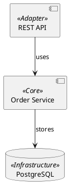

# 📸 Code to Image MCP

MCP сервер для создания высококачественных скриншотов кода с использованием Pygments и Pillow.

## 📁 Структура проекта

```
code_to_image_mcp/
├── server.py              # MCP сервер (точка входа)
├── src/                   # Пакет с бизнес-логикой
│   ├── __init__.py
│   ├── code_to_image.py   # Генерация скриншотов кода
│   ├── diagram_renderer.py # Рендеринг PlantUML диаграмм
│   ├── font_manager.py    # Управление шрифтами
│   ├── font_initializer.py # Инициализация шрифтов для PlantUML
│   ├── image_utils.py     # Утилиты для работы с изображениями
│   └── guide_manager.py   # Управление гайдами по PlantUML
├── tests/                 # Тесты и демонстрационные скрипты
│   ├── test_*.py         # Unit-тесты
│   └── demo_all_diagrams.py # Демо всех типов диаграмм
├── asset/                 # Ресурсы
│   ├── bins/             # PlantUML JAR
│   ├── fonts/            # TTF шрифты
│   └── themes/           # PlantUML темы
└── doc/                   # Документация
    ├── plantuml_guides/  # Гайды по PlantUML
    └── ideas/            # Идеи и планы
```

## ✨ Особенности

- 🎨 **Множество стилей** - monokai, dracula, github-dark, vim и другие
- 🔍 **Высокое качество** - scale_factor для кристальной четкости
- 📝 **Нумерация строк** - настраиваемый стиль и отступы
- 🌈 **Поддержка языков** - Python, TypeScript, JavaScript, SQL, Go, Rust и многие другие
- 💾 **Форматы вывода** - WEBP, PNG, JPEG
- ⚙️ **Гибкая настройка** - шрифты, размеры, отступы

## 📦 Установка

### 1. Создайте виртуальное окружение

```powershell
python -m venv venv
.\venv\Scripts\Activate.ps1
```

### 2. Установите зависимости

```powershell
pip install -r requirements.txt
```

## 🚀 Запуск

### Локальный тест

```powershell
python server.py
```

### Конфигурация в Cline

Добавьте в настройки MCP серверов Cline (Settings → MCP Servers):

```json
{
  "mcpServers": {
    "code-screenshot": {
      "command": "c:\\PY\\code_to_image_mcp\\venv\\Scripts\\python.exe",
      "args": ["c:\\PY\\code_to_image_mcp\\server.py"]
    }
  }
}
```

**Важно:** Путь к `python.exe` должен указывать на интерпретатор из виртуального окружения проекта!

## 💡 Использование

MCP сервер предоставляет **семь инструментов**:

### Скриншоты кода

1. **`generate_code_screenshot`** - создание скриншота из строки кода
2. **`generate_file_screenshot`** - создание скриншота из файла (⚠️ лимит 200 строк)
3. **`generate_entity_screenshot`** - извлечение функции/класса из Python-файла и создание скриншота (✨ без лимита строк)

### PlantUML диаграммы

4. **`generate_architecture_diagram`** - генерация диаграммы из PlantUML кода
5. **`generate_diagram_from_file`** - генерация диаграммы из .puml файла (экономит токены)
6. **`get_plantuml_guide`** - справка по синтаксису PlantUML
7. **`list_plantuml_themes`** - список доступных тем

### Примеры запросов в Cline

**Скриншот из строки кода:**

```text
Создай скриншот этого Python кода и сохрани в C:/screenshots/example.webp
```

**Скриншот из файла:**

```text
Сделай скриншот файла C:/projects/app.py и сохрани в C:/screenshots/app.webp
```

**Скриншот функции из большого файла:**

```text
Создай скриншот функции process_string из файла C:/PY/code_to_image_mcp/test/test_functions.py
```

**С кастомизацией:**

```text
Сделай скриншот метода DataProcessor.validate в стиле dracula, 
размер шрифта 20, масштаб 4x, без декораторов
```

**Без нумерации строк:**

```
"Создай скриншот SQL запроса без номеров строк, 
стиль github-dark, формат WEBP"
```

### Инструменты

#### 1. generate_code_screenshot

Создаёт скриншот из переданной строки кода.

#### 2. generate_file_screenshot

Создаёт скриншот из файла. Автоматически определяет язык по расширению файла.

**⚠️ ВАЖНО:** Максимальный размер файла - **200 строк**. Для больших файлов используйте `generate_entity_screenshot`.

**Поддерживаемые расширения:**
`.py`, `.js`, `.ts`, `.jsx`, `.tsx`, `.java`, `.c`, `.cpp`, `.cs`, `.go`, `.rs`, `.rb`, `.php`, `.swift`, `.kt`, `.scala`, `.sql`, `.html`, `.css`, `.json`, `.yaml`, `.yml`, `.xml`, `.sh`, `.bat`, `.ps1`, `.md`

### 3️⃣ `generate_entity_screenshot` - Извлечение функции/класса из Python-файла

**Умный инструмент** для создания скриншотов конкретных функций, классов или методов из больших Python-файлов без ограничения на размер.

**Пример 1: Извлечь функцию**

```text
Создай скриншот функции process_string из файла C:/test/test_functions.py
```

**Пример 2: Извлечь класс**

```text
Создай скриншот класса DataProcessor из C:/code/processor.py с шрифтом FiraCode
```

**Пример 3: Извлечь метод класса**

```text
Создай скриншот метода DataProcessor.validate из C:/code/processor.py без декораторов
```

**Как это работает:**

- Использует **AST (Abstract Syntax Tree)** для точного извлечения кода
- Автоматически определяет границы функции/класса
- Поддерживает декораторы (можно включить/выключить)
- **Нет лимита на размер исходного файла** - извлекается только нужная сущность

**ВАЖНО (ограничение):** `generate_entity_screenshot` работает только с **Python**-файлами (`*.py`).
Инструмент использует модуль `ast` для парсинга кода — он понимает только
Python-синтаксис. Если передать файл на другом языке (например, JavaScript,
TypeScript, Go и т.д.), парсер выдаст `SyntaxError` или иное исключение.

Если вам нужно создать скриншот для файлов на других языках, используйте
`generate_file_screenshot` (рендеринг всего файла) или формируйте код вручную
и передавайте его через `generate_code_screenshot`.

**Формат entity_name:**

- Функция: `function_name`
- Класс: `ClassName`
- Метод: `ClassName.method_name`

**Что включается в скриншот:**

- Декораторы (если `include_decorators=True`)
- Сигнатура функции/класса
- Тело функции/класса
- Метаданные: имя сущности, исходный файл, диапазон строк

### Параметры инструментов

**Общие параметры:**

| Параметр | Тип | По умолчанию | Описание |
|----------|-----|--------------|----------|
| `output_path` | str | *обязательно* | Абсолютный путь к файлу |
| `language` | str | зависит от инструмента | Язык программирования |
| `style` | str | `monokai` | Стиль подсветки синтаксиса |
| `font` | str | `JetBrainsMono` | Шрифт (JetBrainsMono/FiraCode/CascadiaCode) |
| `font_size` | int | `14-18` | Базовый размер шрифта |
| `scale_factor` | float | `2.0-3.0` | Фактор масштабирования (1.0-5.0) |
| `line_numbers` | bool | `True` | Показывать нумерацию строк |
| `image_format` | str | `webp` | Формат изображения (webp/png/jpeg) |

**Специфичные для `generate_entity_screenshot`:**

| Параметр | Тип | По умолчанию | Описание |
|----------|-----|--------------|----------|
| `file_path` | str | *обязательно* | Путь к исходному Python-файлу |
| `entity_name` | str | *обязательно* | Имя функции/класса/метода |
| `include_decorators` | bool | `True` | Включать декораторы в скриншот |

### Уровни качества (detail_level)

Параметр `detail_level` управляет масштабированием изображения через внутренний `scale_factor`:

| Уровень | scale_factor | Разрешение | Использование |
|---------|-------------|-----------|---------------|
| `Low` | 1.0x | Базовое | Быстрые превью, низкое качество |
| `Medium` | 2.0x | 2x | Веб-документация, балансное качество |
| `High` | 3.0x | 3x | **По умолчанию** - высокое качество |
| `Ultra` | 4.0x | 4x | Презентации, печать, очень высокое качество |
| `Extreme` | 5.0x | 5x | Максимальное качество, большой размер файла |

**Рекомендации:**

- Для веб-документации: `Medium` (2.0x)
- Для GitHub README: `High` (3.0x)
- Для презентаций: `Ultra` (4.0x)
- Для печати в высоком разрешении: `Extreme` (5.0x)

### Популярные стили

- `monokai` - классическая темная тема
- `dracula` - популярная фиолетовая тема
- `github-dark` - стиль GitHub в темной теме
- `vim` - стиль редактора Vim
- `one-dark` - стиль Atom One Dark
- `nord` - холодная скандинавская палитра

### Поддерживаемые языки

Python, JavaScript, TypeScript, Java, C, C++, C#, Go, Rust, Ruby, PHP, Swift, Kotlin, Scala, SQL, HTML, CSS, Shell, Bash, PowerShell, JSON, YAML, Markdown и многие другие.

---

## 📐 Генерация Архитектурных Диаграмм

Помимо скриншотов кода, сервер поддерживает создание **UML-диаграмм** через PlantUML с кастомными темами оформления.

### ⚠️ КРИТИЧЕСКИ ВАЖНЫЕ ПРАВИЛА для AI-агентов

**ПРИ ГЕНЕРАЦИИ ДИАГРАММ ОБЯЗАТЕЛЬНО СЛЕДУЙТЕ ЭТИМ ПРАВИЛАМ:**

1. **НИКОГДА** не используйте директивы `!theme` или `!include` в коде диаграммы
   - Тема применяется автоматически через параметр `theme_name`
   - Пример ошибки: ❌ `!theme dark_gold` в diagram_code
   - Правильно: ✅ Передать `theme_name='dark_gold'` в параметрах

2. **ВСЕГДА** используйте `list_plantuml_themes` ПЕРЕД генерацией диаграммы
   - Не придумывайте несуществующие темы (`darkblue`, `ocean`, `corporate`)
   - Доступные темы: `default`, `dark_gold`, `light_fresh`

3. **ВСЕГДА** используйте `get_plantuml_guide` для сложных диаграмм
   - Проверяйте синтаксис перед генерацией
   - Изучайте доступные стереотипы и элементы

4. **ИСПОЛЬЗУЙТЕ ТОЛЬКО стереотипы** для оформления элементов
   - `<<Adapter>>`, `<<Core>>`, `<<Infrastructure>>` для архитектуры
   - НЕ хардкодите цвета вручную (`#000000`, `#Red`)
   - Тема автоматически применит правильные цвета

5. **Пусть тема управляет ВСЕМИ цветами**
   - Ваша задача - структура диаграммы, не внешний вид
   - Тема обеспечит консистентность оформления

**Пример ПРАВИЛЬНОГО использования:**

```text
Cline: Создай component diagram с темой dark_gold

AI Agent:
1. Вызов list_plantuml_themes() → подтверждаю что 'dark_gold' существует
2. Вызов get_plantuml_guide(diagram_type='component') → изучаю синтаксис
3. Генерирую PlantUML код БЕЗ !theme директив
4. Вызов generate_architecture_diagram(diagram_code=..., theme_name='dark_gold')
```

**Пример НЕПРАВИЛЬНОГО использования:**

```plantuml
❌ @startuml
❌ !theme dark_gold          ← ОШИБКА: НЕ используйте !theme
❌ component API #FF0000     ← ОШИБКА: НЕ хардкодите цвета
❌ @enduml
```

### 🎨 Система стереотипов

Для создания архитектурных диаграмм используется **обязательный контракт стереотипов**, который автоматически применяет цветовую схему из выбранной темы:

| Стереотип | Назначение | Пример цвета (Dark Gold) | Пример использования |
|-----------|------------|-------------------------|----------------------|
| `<<Adapter>>` | Адаптеры (API, UI, CLI) | 🟡 Золотой (#FFD700) | REST API, GraphQL Gateway |
| `<<Core>>` | Ядро бизнес-логики | 🔵 Синий (#4169E1) | Domain Services, Use Cases |
| `<<Infrastructure>>` | Инфраструктура (БД, кеш) | 🟢 Зеленый (#32CD32) | PostgreSQL, Redis, S3 |

**Пример диаграммы компонентов:**



### 🎭 Доступные темы

MCP сервер включает **3 готовые темы**:

1. **`dark_gold`** (по умолчанию) - темный фон, золотые акценты
2. **`light_fresh`** - светлый фон, свежие пастельные цвета
3. **`default`** - стандартная PlantUML палитра

**Предпросмотр тем:** [doc/plantuml_guides/themes.md](doc/plantuml_guides/themes.md)

### 🛠️ MCP Инструменты для диаграмм

Сервер предоставляет **4 специализированных инструмента** для работы с PlantUML:

#### 1. `generate_architecture_diagram`

Создаёт диаграмму из PlantUML кода с автоматическим применением темы.

**Пример запроса в Cline:**

```text
Создай component diagram для микросервисной архитектуры с темой dark_gold:
- API Gateway (Adapter)
- Auth Service (Core)
- PostgreSQL (Infrastructure)
```

**Параметры:**

| Параметр | Тип | По умолчанию | Описание |
|----------|-----|--------------|----------|
| `diagram_code` | str | *обязательно* | PlantUML код диаграммы |
| `output_path` | str | *обязательно* | Путь к выходному PNG файлу |
| `theme` | str | `dark_gold` | Название темы (dark_gold/light_fresh/default) |
| `diagram_type` | str | `component` | Тип диаграммы (component/class/sequence/activity) |

#### 2. `generate_diagram_from_file`

Создаёт диаграмму из сохранённого `.puml` файла — экономит токены и упрощает работу со сложными диаграммами.

**Пример запроса в Cline:**

```text
Сгенерируй диаграмму из файла C:/diagrams/architecture.puml с темой dark_gold
```

**Параметры:**

| Параметр | Тип | По умолчанию | Описание |
|----------|-----|--------------|----------|
| `file_path` | str | *обязательно* | Путь к .puml файлу с PlantUML кодом |
| `output_path` | str | *обязательно* | Путь к выходному изображению |
| `theme` | str | `dark_gold` | Название темы (dark_gold/light_fresh/default) |
| `detail_level` | str | `High` | Уровень детализации (Low/High) |
| `image_format` | str | `png` | Формат (png/svg/eps/pdf) |

#### 3. `get_plantuml_guide`

Возвращает справку по синтаксису PlantUML для AI-агентов.

**Пример:**

```text
Покажи мне краткий гайд по sequence диаграммам
```

**Параметры:**

- `diagram_type`: `class`, `sequence`, `component`, `activity`, `themes`
- `detail_level`: `brief` (краткий) или `full` (полный)

#### 4. `list_plantuml_themes`

Показывает список всех доступных тем с описанием.

**Ответ:**

```json
{
  "themes": [
    {"name": "dark_gold", "description": "Темный фон, золотые акценты"},
    {"name": "light_fresh", "description": "Светлый фон, пастельные тона"},
    {"name": "default", "description": "Стандартная PlantUML палитра"}
  ]
}
```

### 📚 Документация по PlantUML

Для глубокого погружения см. документацию:

- **[Гайды для AI-агентов](doc/plantuml_guides/)** - краткие инструкции по синтаксису
  - [Class Diagram](doc/plantuml_guides/class_diagram.md)
  - [Sequence Diagram](doc/plantuml_guides/sequence_diagram.md)
  - [Component Diagram](doc/plantuml_guides/component_diagram.md)
  - [Activity Diagram](doc/plantuml_guides/activity_diagram.md)
  - [Themes Guide](doc/plantuml_guides/themes.md)

- **[Руководство по созданию PlantUML тем](doc/theme_creation_guide.md)** - ⭐ как создать собственную тему без визуальных артефактов
- **[Руководство разработчика по темам](doc/developers/themes_dev_guide.md)** - внутренняя архитектура темизации
- **[Архитектура проекта](doc/developers/architecture.md)** - как работает PlantUML рендеринг

### 🎯 Быстрый старт с диаграммами

**Шаг 1:** Попросите Cline создать диаграмму

```text
Создай class diagram для паттерна Strategy с темой light_fresh
```

**Шаг 2:** AI-агент автоматически:

- Запросит гайд через `get_plantuml_guide`
- Сгенерирует PlantUML код с правильными стереотипами
- Вызовет `generate_architecture_diagram` с выбранной темой

**Шаг 3:** Получите готовую PNG диаграмму с профессиональным оформлением

### ⚙️ Технические требования

Для работы PlantUML диаграмм необходимо:

- **Java JRE 11+** в PATH
- PlantUML JAR (включен в `asset/bins/plantuml.jar`)
- Кастомные шрифты автоматически устанавливаются при первом запуске

**Проверка Java:**

```powershell
java -version
```

Если Java не установлена:

- Windows: [Adoptium JDK](https://adoptium.net/)
- macOS: `brew install openjdk@17`

---

## 🛠️ Прямое использование функции

Если нужно использовать без MCP:

```python
from src.code_to_image import create_code_screenshot

code = """
def hello_world():
    print("Hello, World!")
"""

create_code_screenshot(
    code_string=code,
    language="python",
    output_file="C:/screenshots/hello.webp",
    style="dracula",
    font_size=20,
    scale_factor=4,
    line_numbers=True
)
```

## 🔧 Решение проблем

**Полное руководство:** [TROUBLESHOOTING.md](TROUBLESHOOTING.md)

**Часто задаваемые вопросы:** [FAQ.md](FAQ.md)

### Быстрые решения

**Ошибка: "Font not found"**

```python
font_name="Consolas"  # Безопасный шрифт для Windows
```

**Ошибка: "Path must be absolute"**

```python
output_path="C:/screenshots/image.webp"  # ✅ Правильно
```

**MCP сервер не подключается**

1. Проверьте путь к `venv\Scripts\python.exe` в конфигурации
2. Перезагрузите Cline: Ctrl+Shift+P → "Developer: Reload Window"

## 🎯 Когда использовать какой инструмент?

| Ситуация | Инструмент | Причина |
|----------|------------|---------|
| Небольшой фрагмент кода | `generate_code_screenshot` | Быстро, не нужен файл |
| Файл целиком (≤200 строк) | `generate_file_screenshot` | Удобно для малых файлов |
| Конкретная функция/класс | `generate_entity_screenshot` | Точная экстракция из больших файлов |
| Метод класса | `generate_entity_screenshot` | Поддержка формата `ClassName.method_name` |
| Файл >200 строк целиком | ❌ Не поддерживается | Используйте `generate_entity_screenshot` для отдельных частей |

## 📄 Лицензия

MIT

## 👨‍💻 Автор

Разработано с использованием AI-ассистента для создания высококачественных скриншотов кода.

---

**Совет:** Для максимального качества используйте `scale_factor: 4-5` и формат `PNG`.
