# 🏗️ Архитектура проекта Code to Image MCP

## Обзор

Проект состоит из двух основных подсистем:

1. **Code Screenshot Engine** — Генерация скриншотов кода через Pygments + Pillow
2. **PlantUML Diagram Renderer** — Рендеринг UML диаграмм через Java + PlantUML JAR

---

## Структура пакета

```
src/
├── code_to_image.py      # Генерация скриншотов кода
├── diagram_renderer.py   # PlantUML рендеринг
├── font_manager.py       # Управление TTF шрифтами
├── font_initializer.py   # Инъекция шрифтов в JRE
├── image_utils.py        # Утилиты обработки изображений
└── guide_manager.py      # Менеджер PlantUML гайдов
```

---

## 1. Code Screenshot Engine

### Технологический стек

- **Pygments** — Лексер и подсветка синтаксиса
- **Pillow (PIL)** — Генерация PNG из форматированного текста
- **ImageMagick-like flow** — Рендер → PIL Image → Сохранение

### Архитектурный паттерн

```
User Request
    ↓
code_to_image.create_code_image()
    ↓
┌─────────────────────────────────┐
│ 1. Pygments Lexer              │ → Парсинг кода по языку
│ 2. Pygments Style              │ → Выбор цветовой схемы
│ 3. ImageFormatter              │ → Рендер в байты PNG
│ 4. PIL Image.open()            │ → Загрузка в память
└─────────────────────────────────┘
    ↓
image_utils.save_image()
    ↓
PNG/WEBP/JPEG файл
```

### Ключевые особенности

#### DPI-масштабирование

```python
# Размер шрифта и отступы умножаются на scale_factor
scaled_font_size = int(font_size * scale_factor)  # 18 * 3.0 = 54
scaled_pad = int(pad * scale_factor)              # 25 * 3.0 = 75
```

**Результат:** Изображение 3840×2160 вместо 1280×720 (4K ready).

#### Кастомные шрифты

```python
font_path = get_font_path("JetBrainsMono")
# → "C:/PY/code_to_image_mcp/asset/fonts/JetBrainsMono-Regular.ttf"

formatter = ImageFormatter(
    font_name=font_path,  # Путь к TTF, НЕ имя шрифта!
    ...
)
```

**Важно:** Pygments требует **абсолютный путь** к TTF файлу, а не имя шрифта из системы.

---

## 2. PlantUML Diagram Renderer

### Технологический стек

- **Java JRE** — Окружение для запуска PlantUML
- **PlantUML JAR** — Движок рендеринга (`asset/bins/plantuml.jar`)
- **Subprocess** — Взаимодействие Python ↔ Java через stdin/stdout
- **Pillow** — Обработка результата (PNG из байтов)

### Архитектурный паттерн

```
User Request
    ↓
diagram_renderer.render_diagram_to_image()
    ↓
┌─────────────────────────────────────────┐
│ 1. Инициализация шрифтов (один раз)    │
│    font_initializer.ensure_fonts_initialized()
│                                         │
│ 2. Подготовка кода диаграммы           │
│    _prepare_diagram_code()             │
│    → Вставка !include темы             │
│    → Добавление !pragma layout smetana │
│                                         │
│ 3. Запуск Java процесса                │
│    subprocess.run([                    │
│      "java", "-jar", "plantuml.jar",   │
│      "-pipe", "-tpng", ...             │
│    ], input=diagram_code)              │
│                                         │
│ 4. Обработка результата                │
│    - Stderr → Проверка ошибок          │
│    - Stdout → PNG байты                │
└─────────────────────────────────────────┘
    ↓
image_utils.load_image_from_bytes()
    ↓
PIL Image объект
```

### Критическая фича: Инъекция шрифтов в JRE

PlantUML использует Java для рендеринга текста. Чтобы **кастомные шрифты** (JetBrains Mono, Fira Code) работали, их нужно скопировать в директорию шрифтов JRE.

#### Процесс инициализации

```
font_initializer.ensure_fonts_initialized()
    ↓
┌────────────────────────────────────────┐
│ 1. Проверка маркера                   │
│    Файл: .fonts_installed.json        │
│    Содержит: путь к JRE, список шрифтов│
│                                        │
│ 2. Если маркера нет:                  │
│    а) Найти Java Home                 │
│       java -XshowSettings:properties  │
│    б) Найти lib/fonts в JRE           │
│    в) Скопировать *.ttf из asset/fonts│
│    г) Создать маркер                  │
│                                        │
│ 3. Если маркер есть:                  │
│    → Пропустить (уже установлено)     │
└────────────────────────────────────────┘
```

#### Пример маркера

```json
{
  "java_home": "C:\\Program Files\\Java\\jdk-17",
  "fonts_installed": [
    "JetBrainsMono-Regular.ttf",
    "FiraCode-Regular.ttf"
  ],
  "platform": "Windows",
  "timestamp": "1701350400.0"
}
```

**Зачем это нужно?**

- PlantUML **не видит** шрифты из `asset/fonts/` без установки в JRE
- Windows API `AddFontResourceExW` работает только для текущего процесса, но не для дочернего Java процесса
- Копирование в JRE — единственный кросс-платформенный способ

---

## 3. Система тем PlantUML

### Архитектура

```
User: theme="dark_gold"
    ↓
diagram_renderer._prepare_diagram_code()
    ↓
┌────────────────────────────────────────┐
│ 1. Проверка существования темы        │
│    Path("asset/themes/dark_gold.puml") │
│                                        │
│ 2. Вставка директивы включения        │
│    !include asset/themes/dark_gold.puml│
│    → Добавляется ПЕРЕД @startuml       │
│                                        │
│ 3. Добавление Smetana (новый движок)  │
│    !pragma layout smetana              │
│    → Улучшает качество автолейаута    │
└────────────────────────────────────────┘
```

### Пример преобразования кода

**Входной код:**


**После обработки `_prepare_diagram_code()`:**

```plantuml
@startuml
!pragma layout smetana
!include asset/themes/dark_gold.puml

component "API" <<Adapter>>
@enduml
```

**Ключевое отличие:** PlantUML сначала читает стили из темы, **потом** применяет их к компонентам с стереотипами.

---

## 4. Обработка изображений (image_utils)

### Универсальный Pipeline

```python
# 1. Источник: Pillow Image (из Pygments или PlantUML)
image: PIL.Image.Image

# 2. Опционально: масштабирование
if scale_factor != 1.0:
    image = resize_image(image, scale_factor)

# 3. Сохранение с оптимизацией
save_image(
    image,
    output_path="result.webp",
    format="webp",
    quality=90  # Баланс качество/размер
)
```

### Оптимизации

#### WebP (рекомендуется)

- **Метод:** `lossless=False` + качество 90
- **Результат:** Размер файла на 30% меньше PNG при том же визуальном качестве

#### PNG

- **Метод:** `optimize=True` + `compress_level=9`
- **Результат:** Медленнее, но без потери качества

#### JPEG

- **Автоконверсия RGBA → RGB** (JPEG не поддерживает альфа-канал)
- **Качество:** 92 (баланс для кода с мелким текстом)

---

## 5. Управление гайдами (guide_manager)

### Назначение

Предоставляет **AI-агентам** краткие/полные инструкции по PlantUML синтаксису прямо через MCP инструмент.

### Архитектура

```
doc/plantuml_guides/
├── index.json           # Метаданные всех гайдов
├── class_diagram.md     # Markdown с маркерами
├── sequence_diagram.md
└── themes.md

Markdown структура:
<!-- BRIEF_START -->
Краткое описание (500 символов)
<!-- BRIEF_END -->

<!-- DETAILED_START -->
Полное руководство (без ограничений)
<!-- DETAILED_END -->
```

### Использование в MCP

```python
# Инструмент для AI-агента
@mcp.tool()
def get_plantuml_guide(diagram_type: str, detail_level: str = "brief"):
    content = get_guide(diagram_type, full=(detail_level == "full"))
    return {"guide": content}
```

**Польза:** Агент может запросить инструкцию прямо во время диалога, не загружая весь гайд в промпт.

---

## 6. Потоки данных

### Генерация скриншота кода (High-level)


### Генерация диаграммы (High-level)

```mermaid
graph TD
    A[MCP Tool Call] --> B[server.py]
    B --> C[diagram_renderer.py]
    C --> D{Шрифты установлены?}
    D -- Нет --> E[font_initializer]
    E --> F[Копирование TTF в JRE]
    F --> G[Java PlantUML Process]
    D -- Да --> G
    G --> H[PNG bytes]
    H --> I[PIL Image]
    I --> J[image_utils.save]
    J --> K[PNG/SVG файл]
```



---

## 7. Кросс-платформенность

### Windows

- ✅ Font injection через копирование в JRE (работает)
- ✅ Subprocess с UTF-8 кодировкой
- ⚠️ Требуется Java 11+ в PATH

### macOS

- ✅ Font injection через JRE
- ✅ Homebrew Java поддерживается
- ⚠️ Документация: `doc/macos_compatibility.md`

### Linux

- ✅ Font injection через JRE
- ✅ OpenJDK из репозиториев
- ⚠️ Требуются права на запись в `/usr/lib/jvm/.../lib/fonts`

---

## 8. Производительность

### Узкие места

| Операция | Время | Оптимизация |
|----------|-------|-------------|
| PlantUML рендеринг | 1-3 сек | Кеширование результатов не реализовано |
| Инъекция шрифтов | 500 мс | Выполняется 1 раз, затем пропускается |
| Pygments рендеринг | 100-300 мс | Зависит от длины кода |
| Сохранение WEBP | 50-200 мс | Быстрее PNG на 40% |

### Рекомендации

1. **Для массовой генерации:** Реализовать кеш PlantUML результатов (хеш кода → файл)
2. **Для API:** Использовать асинхронные задачи (Celery)
3. **Для презентаций:** Генерировать в 4K один раз, переиспользовать

---

## 9. Безопасность

### PlantUML Code Injection

PlantUML поддерживает `!include` директивы, которые могут читать локальные файлы:

```plantuml
@startuml
!include /etc/passwd
@enduml
```

**Защита:** В `_prepare_diagram_code()` мы **заменяем** пользовательский код, вставляя только безопасные директивы. PlantUML запускается с `-failfast2`, который блокирует опасные операции.

### Java Sandbox

PlantUML JAR запускается **без** сетевого доступа (`-Dplantuml.security.mode=sandbox` в будущих версиях).

---

## 10. Тестирование

### Структура тестов

```
tests/
├── test_code_to_image.py     # (TODO) Скриншоты кода
├── test_diagram_renderer.py  # PlantUML рендеринг
├── test_font_*.py            # Инъекция шрифтов
├── test_guide_manager.py     # Гайды
└── test_image_utils.py       # Обработка изображений
```

### Запуск

```bash
pytest tests/ -v              # Все тесты
pytest tests/test_image_utils.py -v  # Один модуль
pytest -k "font" -v           # Только font-тесты
```

---

## Полезные ссылки

- [PlantUML официальная документация](https://plantuml.com/ru/)
- [Pygments документация](https://pygments.org/docs/)
- [Pillow руководство](https://pillow.readthedocs.io/)
- [FastMCP документация](https://github.com/jlowin/fastmcp)

---

**Вопросы по архитектуре?** Изучите код модулей или откройте Issue в репозитории.
