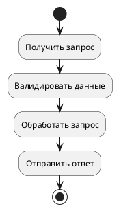
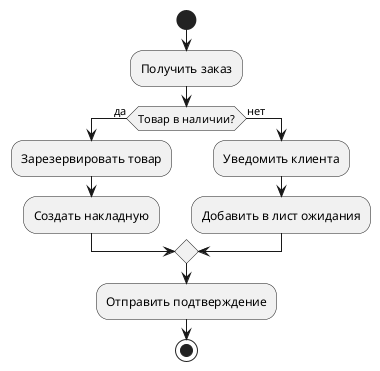
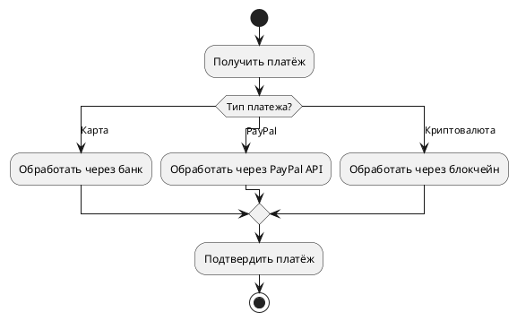
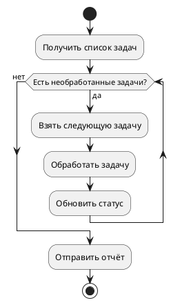
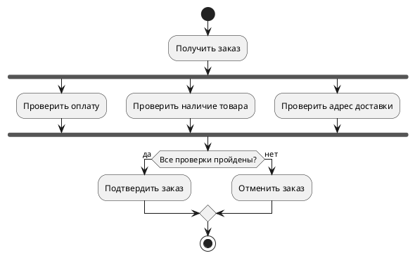
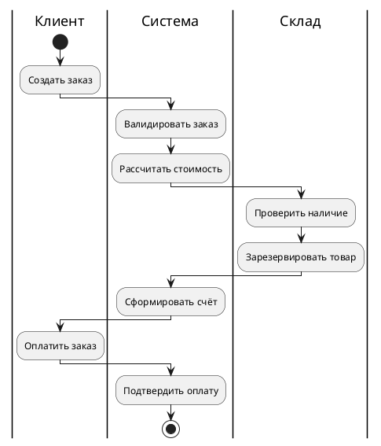
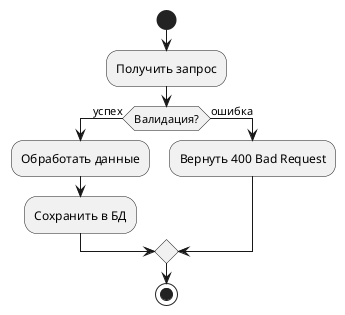
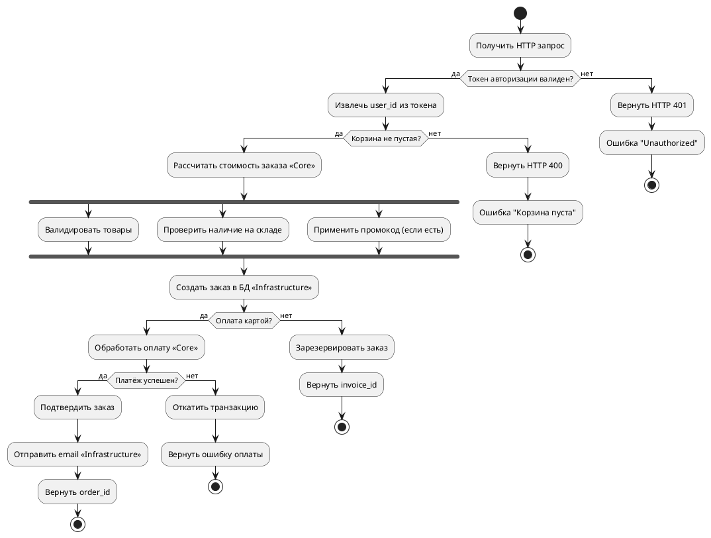

# Activity Diagram Guide

<!-- BRIEF_START -->
## ⚠️ КРИТИЧЕСКИ ВАЖНО ДЛЯ AI МОДЕЛЕЙ

**ЗАПРЕЩЕНО ИСПОЛЬЗОВАТЬ:**

- ❌ `!theme` или `!include` директивы
- ❌ `skinparam` настройки
- ❌ Жёстко прописанные цвета (#RRGGBB)

**ПРАВИЛЬНЫЙ ПОДХОД:**

- ✅ НЕ используйте стилизацию в activity диаграммах
- ✅ Передавайте тему через параметр `theme_name`
- ✅ Генерируйте ЧИСТЫЙ PlantUML код без стилизации!

---

**Синтаксис базовых элементов:**

```plantuml
start
:Действие;
stop
```

**Условия:**

```plantuml
if (условие?) then (да)
    :Действие A;
else (нет)
    :Действие B;
endif
```

**Циклы:**

```plantuml
while (условие?) is (да)
    :Повторяющееся действие;
endwhile (нет)
```

**Параллельность:**

```plantuml
fork
    :Действие A;
fork again
    :Действие B;
end fork
```
<!-- BRIEF_END -->

<!-- DETAILED_START -->
## Примеры использования

### Простой процесс



### Условная логика



### Множественный выбор



### Цикл обработки



### Параллельная обработка



### Разделение на зоны ответственности (swimlanes)



## Частые ошибки

1. **Забыли start/stop:**
   - Диаграмма должна начинаться с `start`
   - И заканчиваться `stop` или `end`

2. **Забыли точку с запятой:**
   - ❌ `:Действие`
   - ✅ `:Действие;`

3. **Неправильный синтаксис if:**
   - ❌ `if условие`
   - ✅ `if (условие?) then (да)`

4. **Незакрытые блоки:**
   - `if` требует `endif`
   - `while` требует `endwhile`
   - `fork` требует `end fork`

## Элементы диаграммы

| Элемент | Описание |
|---------|----------|
| `start` | Начало процесса (чёрный кружок) |
| `stop` | Конец процесса (чёрный кружок в кольце) |
| `end` | Альтернативный конец |
| `:Текст;` | Действие (прямоугольник со скруглёнными краями) |
| `if/else/endif` | Условный переход (ромб) |
| `switch/case` | Множественный выбор |
| `while/endwhile` | Цикл с условием |
| `repeat/repeatwhile` | Цикл do-while |
| `fork/end fork` | Параллельное выполнение |
| `|Swimlane|` | Разделение по зонам ответственности |

## Styling & Themes

⚠️ **КРИТИЧЕСКИ ВАЖНО ДЛЯ AI МОДЕЛЕЙ:**

**ЗАПРЕЩЕНО:**

- ❌ Использовать `!theme` или `!include` директивы
- ❌ Жёстко прописывать цвета (например: `skinparam activityBackgroundColor green`)
- ❌ Переопределять стили через `skinparam` в diagram_code

**ПРАВИЛЬНЫЙ ПОДХОД:**

- ✅ ВСЕГДА вызывайте `list_plantuml_themes` перед генерацией диаграммы
- ✅ Передавайте выбранную тему через параметр `theme_name`
- ✅ Доверьте цвета и стили теме — ваша задача логика процесса
- ✅ Используйте swimlanes для визуального разделения ответственности

**Пример правильного использования:**



## Production-Ready Example

**Это полноценный пример из реальных тестов проекта (`tests/assets/activity_diagram.puml`).**

Демонстрирует сложный бизнес-процесс создания заказа с условиями, параллельностью и использованием стереотипов:



**Ключевые моменты:**

- ✅ НЕТ директив !theme, !include, skinparam
- ✅ НЕТ жёстко прописанных цветов
- ✅ Использование стереотипов для обозначения слоёв (<<Core>>, <<Infrastructure>>)
- ✅ Правильное использование fork/end fork для параллельности
- ✅ Множественные условные переходы с разными исходами
- ✅ Чистый PlantUML код, готовый к использованию с любой темой

<!-- DETAILED_END -->
