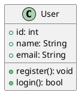
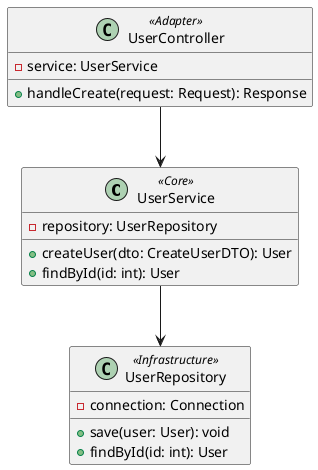
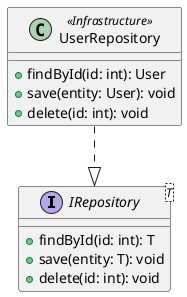
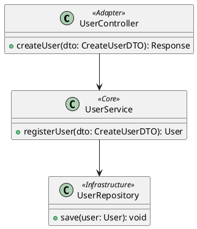

# Class Diagram Guide

<!-- BRIEF_START -->
**Синтаксис:**

```plantuml
class "ClassName" <<Stereotype>> {
    + publicField: Type
    - privateField: Type
    # protectedField: Type
    + publicMethod(): ReturnType
    - privateMethod(): ReturnType
}
```

**Доступные стереотипы (рекомендуется использовать):**

* `<<Adapter>>` — Входные точки: API, UI, Controllers, Views. Цвет: Зелёный/Белый.
* `<<Core>>` — Бизнес-логика: Services, UseCases, Domain. Цвет: Жёлтый/Золотой.
* `<<Infrastructure>>` — Инфраструктура: БД, Кеш, Внешние API, Repositories. Цвет: Синий/Серый.

**Отношения:**

* `A --|> B` — наследование (A extends B)
* `A ..|> B` — реализация интерфейса (A implements B)
* `A --> B` — ассоциация/зависимость
* `A --o B` — агрегация (A содержит B, но B может существовать отдельно)
* `A --* B` — композиция (A владеет B, B не может существовать без A)
<!-- BRIEF_END -->

<!-- DETAILED_START -->
## Примеры использования

### Простой класс



### Класс со стереотипом



### Интерфейсы и наследование



## Частые ошибки

1. **Забытые кавычки в именах с пробелами:**
   * ❌ `class User Service`
   * ✅ `class "User Service"`

2. **Неправильный синтаксис стереотипа:**
   * ❌ `class UserService <Core>`
   * ✅ `class "UserService" <<Core>>`

3. **Забытые модификаторы доступа:**
   * ❌ `name: String`
   * ✅ `+ name: String` (public)

## Модификаторы доступа

| Символ | Значение |
|--------|----------|
| `+` | public |
| `-` | private |
| `#` | protected |
| `~` | package |

## Styling & Themes

⚠️ **КРИТИЧЕСКИ ВАЖНО ДЛЯ AI МОДЕЛЕЙ:**

**ЗАПРЕЩЕНО:**
* ❌ Использовать `!theme` или `!include` директивы
* ❌ Жёстко прописывать цвета (например: `#backgroundColor yellow`)
* ❌ Переопределять стили через `skinparam` в diagram_code

**ПРАВИЛЬНЫЙ ПОДХОД:**
* ✅ Используйте ТОЛЬКО стереотипы: `<<Adapter>>`, `<<Core>>`, `<<Infrastructure>>`
* ✅ ВСЕГДА вызывайте `list_plantuml_themes` перед генерацией диаграммы
* ✅ Передавайте выбранную тему через параметр `theme_name`
* ✅ Доверьте цвета и стили теме — ваша задача структура классов и их отношения

**Пример правильного использования:**


<!-- DETAILED_END -->
