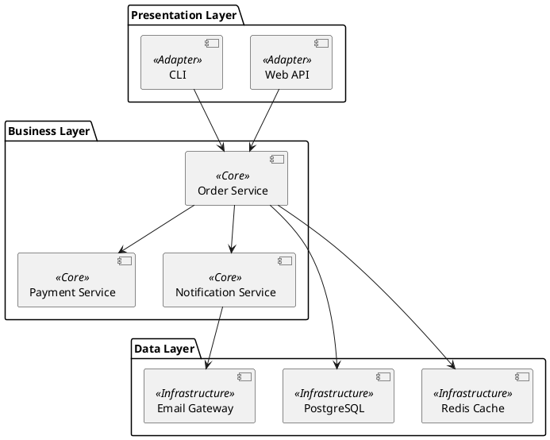
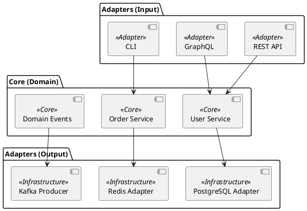
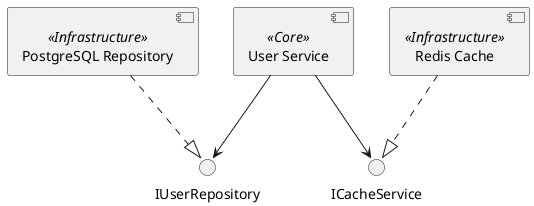

# Component Diagram Guide

<!-- BRIEF_START -->
**Синтаксис:**
```plantuml
component "Name" <<Stereotype>>
[ShortName] <<Stereotype>>
```

**Доступные стереотипы (ОБЯЗАТЕЛЬНО использовать для архитектурных диаграмм):**
* `<<Adapter>>` — Входные точки: API, UI, Views, Controllers. Цвет: Зелёный/Белый.
* `<<Core>>` — Бизнес-логика: Services, UseCases, Domain. Цвет: Жёлтый/Золотой.
* `<<Infrastructure>>` — Инфраструктура: БД, Кеш, Внешние API. Цвет: Синий/Серый.

**Связи:**
* `A --> B` — зависимость
* `A ..> B` — пунктирная зависимость
* `A --( B` — интерфейс

**Группировка:**
```plantuml
package "Layer Name" {
    component "A"
    component "B"
}
```
<!-- BRIEF_END -->

<!-- DETAILED_START -->
## Примеры использования

### Трёхслойная архитектура


### Hexagonal Architecture


### Интерфейсы


## Частые ошибки

1. **Забыли стереотип:**
   - ❌ `component "Service"` — не понятна роль
   - ✅ `component "Service" <<Core>>` — бизнес-логика

2. **Неправильный синтаксис стереотипа:**
   - ❌ `component "API" <Adapter>`
   - ✅ `component "API" <<Adapter>>`

3. **Смешивание слоёв:**
   - Adapter не должен напрямую обращаться к Infrastructure
   - Только через Core!

## Рекомендации по слоям

### Adapter Layer (Зелёный/Белый)
- REST Controllers
- GraphQL Resolvers
- CLI Commands
- Web Views
- Message Consumers

### Core Layer (Жёлтый/Золотой)
- Domain Services
- Use Cases
- Domain Entities
- Business Rules
- Domain Events

### Infrastructure Layer (Синий/Серый)
- Database Repositories
- Cache Clients
- External API Clients
- Message Producers
- File Storage
<!-- DETAILED_END -->
