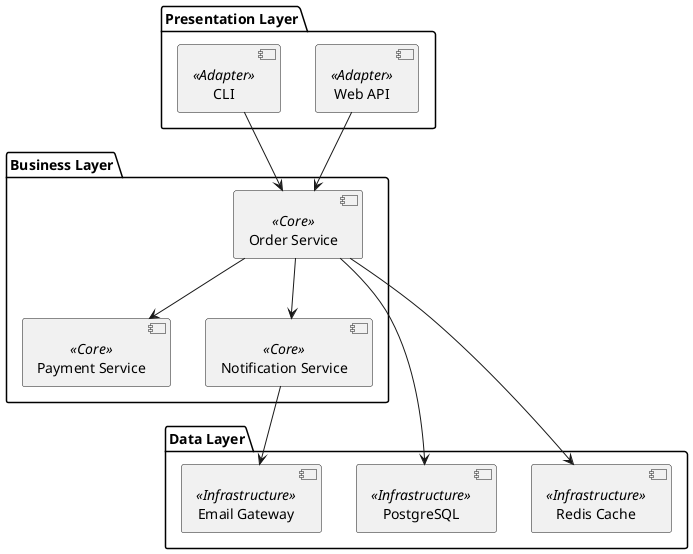
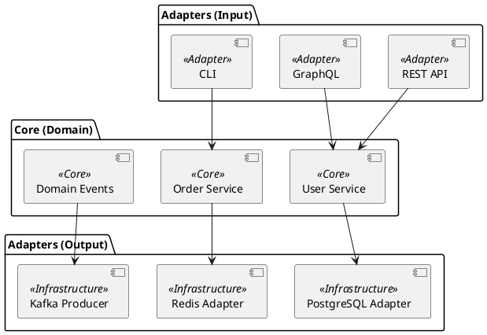
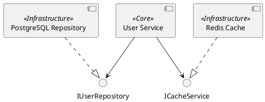
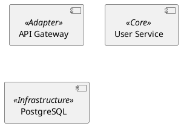
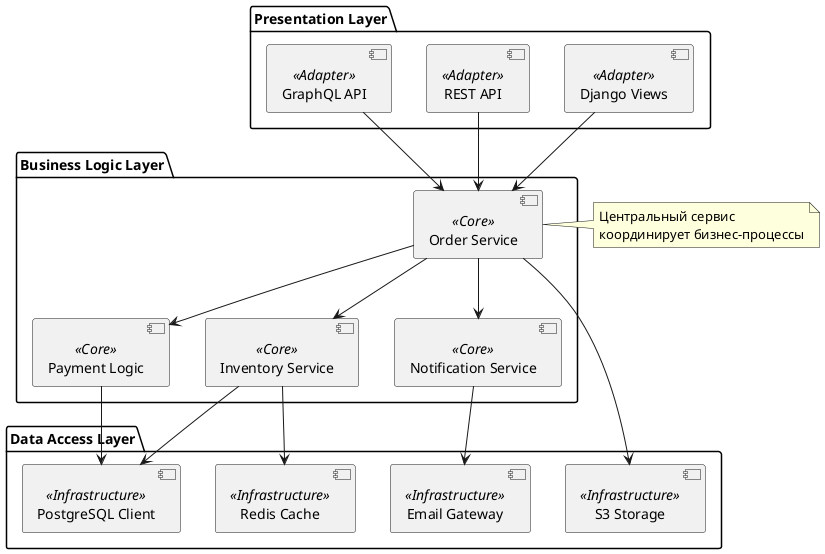

# Component Diagram Guide

<!-- BRIEF_START -->
## ⚠️ КРИТИЧЕСКИ ВАЖНО ДЛЯ AI МОДЕЛЕЙ

**ЗАПРЕЩЕНО ИСПОЛЬЗОВАТЬ:**

- ❌ `!theme` или `!include` директивы
- ❌ `skinparam` настройки
- ❌ Жёстко прописанные цвета (#RRGGBB)

**ПРАВИЛЬНЫЙ ПОДХОД:**

- ✅ Используйте ТОЛЬКО стереотипы: `<<Adapter>>`, `<<Core>>`, `<<Infrastructure>>`
- ✅ Передавайте тему через параметр `theme_name`
- ✅ Генерируйте ЧИСТЫЙ PlantUML код без стилизации!

---

**Синтаксис:**

```plantuml
component "Name" <<Stereotype>>
[ShortName] <<Stereotype>>
```

**Доступные стереотипы (ОБЯЗАТЕЛЬНО использовать для архитектурных диаграмм):**

- `<<Adapter>>` — Входные точки: API, UI, Views, Controllers. Цвет: Зелёный/Белый.
- `<<Core>>` — Бизнес-логика: Services, UseCases, Domain. Цвет: Жёлтый/Золотой.
- `<<Infrastructure>>` — Инфраструктура: БД, Кеш, Внешние API. Цвет: Синий/Серый.

**Связи:**

- `A --> B` — зависимость
- `A ..> B` — пунктирная зависимость
- `A --( B` — интерфейс

**Группировка:**

```plantuml
package "Layer Name" {
    component "A"
    component "B"
}
```
<!-- BRIEF_END -->

<!-- DETAILED_START -->
## Примеры использования

### Трёхслойная архитектура



### Hexagonal Architecture



### Интерфейсы



## Частые ошибки

1. **Забыли стереотип:**
   - ❌ `component "Service"` — не понятна роль
   - ✅ `component "Service" <<Core>>` — бизнес-логика

2. **Неправильный синтаксис стереотипа:**
   - ❌ `component "API" <Adapter>`
   - ✅ `component "API" <<Adapter>>`

3. **Смешивание слоёв:**
   - Adapter не должен напрямую обращаться к Infrastructure
   - Только через Core!

## Рекомендации по слоям

### Adapter Layer (Зелёный/Белый)

- REST Controllers

* GraphQL Resolvers
- CLI Commands
- Web Views
- Message Consumers

### Core Layer (Жёлтый/Золотой)

- Domain Services

* Use Cases
- Domain Entities
- Business Rules
- Domain Events

### Infrastructure Layer (Синий/Серый)

- Database Repositories

* Cache Clients
- External API Clients
- Message Producers
- File Storage

## Styling & Themes

⚠️ **КРИТИЧЕСКИ ВАЖНО ДЛЯ AI МОДЕЛЕЙ:**

**ЗАПРЕЩЕНО:**
- ❌ Использовать `!theme` или `!include` директивы
- ❌ Жёстко прописывать цвета (например: `#backgroundColor red`)
- ❌ Переопределять стили через `skinparam` в diagram_code

**ПРАВИЛЬНЫЙ ПОДХОД:**
- ✅ Используйте ТОЛЬКО стереотипы: `<<Adapter>>`, `<<Core>>`, `<<Infrastructure>>`
- ✅ ВСЕГДА вызывайте `list_plantuml_themes` перед генерацией диаграммы
- ✅ Передавайте выбранную тему через параметр `theme_name`
- ✅ Доверьте цвета и стили теме — ваша задача структура, а не внешний вид

**Пример правильного использования:**



## Production-Ready Example

**Это полноценный пример из реальных тестов проекта (`tests/assets/component_diagram.puml`).**

Демонстрирует правильную многослойную архитектуру с разделением входных адаптеров, бизнес-логики и инфраструктуры:



**Ключевые моменты:**

- ✅ Используются ТОЛЬКО стереотипы (<<Adapter>>, <<Core>>, <<Infrastructure>>)
- ✅ НЕТ директив !theme, !include, skinparam
- ✅ НЕТ жёстко прописанных цветов (#RRGGBB)
- ✅ Чистый PlantUML код, готовый к использованию с любой темой
- ✅ Правильное разделение по слоям: Presentation → Business Logic → Data Access
- ✅ Использование псевдонимов (as) для компактности

<!-- DETAILED_END -->
