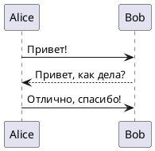
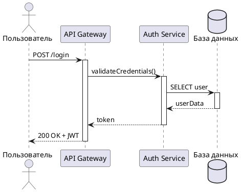
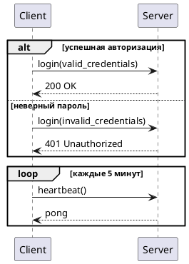
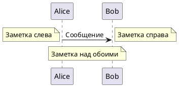
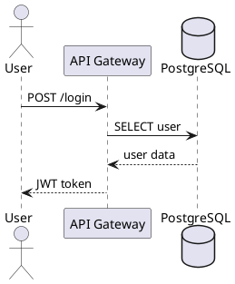
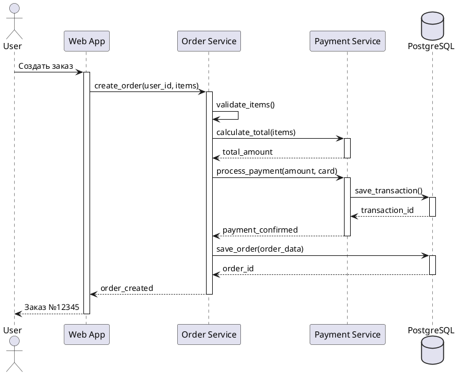

# Sequence Diagram Guide

<!-- BRIEF_START -->
## ⚠️ КРИТИЧЕСКИ ВАЖНО ДЛЯ AI МОДЕЛЕЙ

**ЗАПРЕЩЕНО ИСПОЛЬЗОВАТЬ:**

- ❌ `!theme` или `!include` директивы
- ❌ `skinparam` настройки
- ❌ Жёстко прописанные цвета (#RRGGBB)

**ПРАВИЛЬНЫЙ ПОДХОД:**

- ✅ НЕ используйте стилизацию в sequence диаграммах
- ✅ Передавайте тему через параметр `theme_name`
- ✅ Генерируйте ЧИСТЫЙ PlantUML код без стилизации!

---

**Синтаксис участников:**

```plantuml
participant "Имя" as alias
actor "Актор" as actorAlias
database "БД" as db
```

**Синтаксис сообщений:**

- `A -> B: Сообщение` — синхронный запрос
- `A --> B: Ответ` — пунктирный ответ
- `A ->> B: Async` — асинхронный запрос
- `A -x B: Отмена` — отмена/ошибка

**Активация (lifeline bars):**

```plantuml
activate A
A -> B: Запрос
deactivate A
```

**Группировка:**

```plantuml
alt условие
    A -> B: если true
else иначе
    A -> B: если false
end
```
<!-- BRIEF_END -->

<!-- DETAILED_START -->
## Примеры использования

### Простая последовательность



### Участники с типами



### Условия и циклы



### Заметки



## Частые ошибки

1. **Забыли deactivate:**
   - Если используете `activate`, не забудьте `deactivate`
   - Иначе бар активации уходит до конца диаграммы

2. **Неправильный порядок стрелок:**
   - `->` сплошная стрелка (запрос)
   - `-->` пунктирная стрелка (ответ)

3. **Кириллица без кавычек:**
   - ❌ `participant Пользователь`
   - ✅ `participant "Пользователь" as User`

## Типы участников

| Тип | Описание |
|-----|----------|
| `participant` | Обычный участник (прямоугольник) |
| `actor` | Человек-актор (фигурка) |
| `database` | База данных (цилиндр) |
| `entity` | Сущность |
| `boundary` | Граница системы |
| `control` | Контроллер |
| `collections` | Коллекция |
| `queue` | Очередь |

## Styling & Themes

⚠️ **КРИТИЧЕСКИ ВАЖНО ДЛЯ AI МОДЕЛЕЙ:**

**ЗАПРЕЩЕНО:**
- ❌ Использовать `!theme` или `!include` директивы
- ❌ Жёстко прописывать цвета (например: `skinparam sequenceMessageAlign center`)
- ❌ Переопределять стили через `skinparam` в diagram_code

**ПРАВИЛЬНЫЙ ПОДХОД:**
- ✅ ВСЕГДА вызывайте `list_plantuml_themes` перед генерацией диаграммы
- ✅ Передавайте выбранную тему через параметр `theme_name`
- ✅ Доверьте цвета и стили теме — ваша задача структура взаимодействий
- ✅ Используйте типизированных участников (`actor`, `database`, `participant`) для автоматической стилизации

**Пример правильного использования:**



## Production-Ready Example

**Это полноценный пример из реальных тестов проекта (`tests/assets/sequence_diagram.puml`).**

Демонстрирует полноценный сценарий создания заказа с активацией участников и взаимодействием между слоями:



**Ключевые моменты:**

- ✅ НЕТ директив !theme, !include, skinparam
- ✅ НЕТ жёстко прописанных цветов
- ✅ Правильное использование activate/deactivate для визуализации времени жизни
- ✅ Типизированные участники (actor, participant, database)
- ✅ Сплошные стрелки для запросов (->), пунктирные для ответов (-->)
- ✅ Чистый PlantUML код, готовый к использованию с любой темой

<!-- DETAILED_END -->
