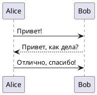
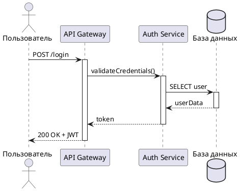
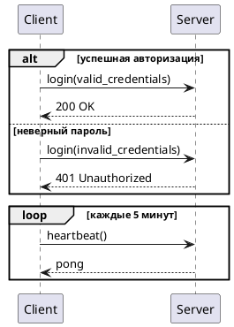
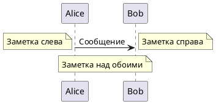

# Sequence Diagram Guide

<!-- BRIEF_START -->
**Синтаксис участников:**
```plantuml
participant "Имя" as alias
actor "Актор" as actorAlias
database "БД" as db
```

**Синтаксис сообщений:**
* `A -> B: Сообщение` — синхронный запрос
* `A --> B: Ответ` — пунктирный ответ
* `A ->> B: Async` — асинхронный запрос
* `A -x B: Отмена` — отмена/ошибка

**Активация (lifeline bars):**
```plantuml
activate A
A -> B: Запрос
deactivate A
```

**Группировка:**
```plantuml
alt условие
    A -> B: если true
else иначе
    A -> B: если false
end
```
<!-- BRIEF_END -->

<!-- DETAILED_START -->
## Примеры использования

### Простая последовательность


### Участники с типами


### Условия и циклы


### Заметки


## Частые ошибки

1. **Забыли deactivate:**
   - Если используете `activate`, не забудьте `deactivate`
   - Иначе бар активации уходит до конца диаграммы

2. **Неправильный порядок стрелок:**
   - `->` сплошная стрелка (запрос)
   - `-->` пунктирная стрелка (ответ)

3. **Кириллица без кавычек:**
   - ❌ `participant Пользователь`
   - ✅ `participant "Пользователь" as User`

## Типы участников

| Тип | Описание |
|-----|----------|
| `participant` | Обычный участник (прямоугольник) |
| `actor` | Человек-актор (фигурка) |
| `database` | База данных (цилиндр) |
| `entity` | Сущность |
| `boundary` | Граница системы |
| `control` | Контроллер |
| `collections` | Коллекция |
| `queue` | Очередь |
<!-- DETAILED_END -->
