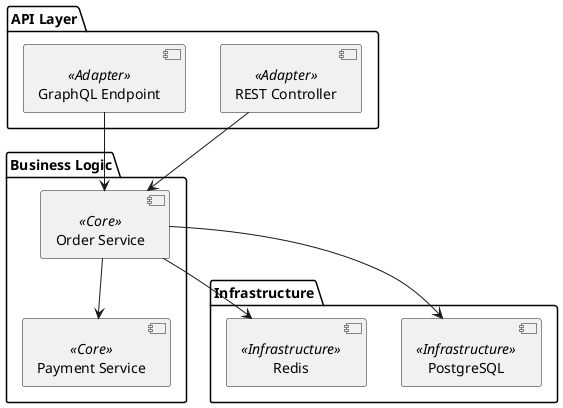
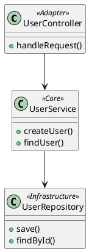
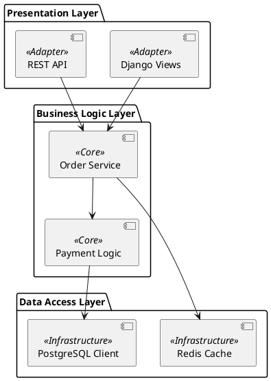
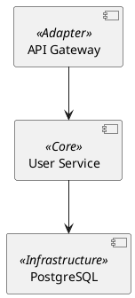

# Themes Guide

<!-- BRIEF_START -->
## ⚠️ КРИТИЧЕСКИ ВАЖНО ДЛЯ AI МОДЕЛЕЙ

**НЕ УКАЗЫВАЙТЕ ТЕМУ В DIAGRAM_CODE!**

**ЗАПРЕЩЕНО В diagram_code:**

- ❌ `!theme dark_gold` или `!theme любая_тема`
- ❌ `!include <C4/C4_Context>` или другие !include
- ❌ `skinparam` настройки
- ❌ Жёстко прописанные цвета (#RRGGBB)

**ПРАВИЛЬНЫЙ ПОДХОД:**

- ✅ Передавайте тему через параметр `theme_name='dark_gold'`
- ✅ Генерируйте ЧИСТЫЙ PlantUML код без стилизации
- ✅ Используйте ТОЛЬКО стереотипы для семантики

---

**Доступные темы:**

| Тема | Описание | Лучше для |
|------|----------|-----------|
| `default` | Современная тёмная тема VS Code стиля | Общее использование |
| `dark_gold` | Строгая тёмная тема с золотым акцентом | Презентации, доклады |
| `light_fresh` | Мягкая светлая тема с мятными тонами | Документация, печать |

**Стереотипы и цвета:**

Во всех темах стереотипы имеют семантическое значение:
- `<<Adapter>>` — Входные точки (API, UI). Цвет: контрастный/выделяющийся
- `<<Core>>` — Бизнес-логика. Цвет: акцентный (золотой/жёлтый)
- `<<Infrastructure>>` — Инфраструктура. Цвет: приглушённый (серый/синий)

**Использование:**

```python
generate_architecture_diagram(
    diagram_code=code,
    output_path="/path/to/output.png",
    theme_name="dark_gold"  # или "light_fresh", "default"
)
```
<!-- BRIEF_END -->

<!-- DETAILED_START -->
## Детальное описание тем

### default

Универсальная тёмная тема в стиле VS Code.

**Характеристики:**

- Фон: `#1E1E1E` (тёмно-серый)
- Текст: `#D4D4D4` (светло-серый)
- Акценты: `#007ACC` (синий VS Code)
- Шрифт: JetBrains Mono

**Когда использовать:**

- Общие диаграммы
- Техническая документация
- README файлы

### dark_gold

Строгая презентационная тема с золотым акцентом.

**Характеристики:**

- Фон: `#222222` (почти чёрный)
- Текст: `#EEEEEE` (белый)
- Акцент: `#FFB300` (золотой)
- Границы: `#FFFFFF` (белые)
- Шрифт: JetBrains Mono

**Стереотипы:**

- `<<Adapter>>`: Тёмный фон, белые границы
- `<<Core>>`: Золотистый фон, золотые границы и текст
- `<<Infrastructure>>`: Серый фон, серые границы

**Когда использовать:**

- Презентации на проекторе
- Видео и скринкасты
- Когда нужен сильный контраст

### light_fresh

Мятная светлая тема для документации.

**Характеристики:**

- Фон: `#f0faf5` (светло-мятный)
- Текст: `#0b2e1d` (тёмно-зелёный)
- Акцент: `#4dd191` (мятный)
- Шрифт: JetBrains Mono

**Стереотипы:**

- `<<Adapter>>`: Светлый фон, мятная граница
- `<<Core>>`: Кремовый фон, жёлтая граница
- `<<Infrastructure>>`: Светло-синий фон, синяя граница

**Когда использовать:**

- Печатная документация
- Светлые интерфейсы
- Когда нужна "мягкость"

## Примеры использования стереотипов

### Component Diagram с темой dark_gold



### Class Diagram с темой light_fresh



## Создание собственной темы

Темы хранятся в `asset/themes/` как `.puml` файлы.

**Структура темы:**

```plantuml
' 1. Шрифты
skinparam defaultFontName "JetBrains Mono"
skinparam defaultFontSize 14

' 2. Глобальные цвета
skinparam backgroundColor #XXXXXX

' 3. Стереотипы для class
skinparam class<<Adapter>> {
    BackgroundColor #XXXXXX
    BorderColor #XXXXXX
    FontColor #XXXXXX
}

' 4. Стереотипы для component
skinparam component<<Adapter>> {
    BackgroundColor #XXXXXX
    BorderColor #XXXXXX
    FontColor #XXXXXX
}

' 5. Другие элементы...
```

## Рекомендации

1. **Всегда используйте стереотипы** для архитектурных диаграмм
2. **Выбирайте тему под контекст** — светлая для печати, тёмная для экрана
3. **Используйте High detail_level** для презентаций (3x масштаб)
4. **Тестируйте на целевом устройстве** — цвета могут отличаться

## Production-Ready Example: Правильный Workflow

**НЕПРАВИЛЬНО ❌ (НЕ ДЕЛАЙТЕ ТАК!):**

```plantuml
@startuml
!theme dark_gold  ❌ ОШИБКА! НЕ УКАЗЫВАЙТЕ ТЕМУ ЗДЕСЬ!

component "API" <<Adapter>>
component "Service" <<Core>>

API --> Service
@enduml
```

**ПРАВИЛЬНО ✅:**

```python
# ШАГ 1: Спросить список доступных тем
themes = list_plantuml_themes()
# Возврат: {"themes": ["default", "dark_gold", "light_fresh"]}

# ШАГ 2: Сгенерировать ЧИСТЫЙ PlantUML код (без !theme)
diagram_code = """
@startuml
component "API Gateway" <<Adapter>>
component "User Service" <<Core>>
component "PostgreSQL" <<Infrastructure>>

"API Gateway" --> "User Service"
"User Service" --> "PostgreSQL"
@enduml
"""

# ШАГ 3: Передать тему ЧЕРЕЗ ПАРАМЕТР
result = generate_architecture_diagram(
    diagram_code=diagram_code,  # ЧИСТЫЙ PlantUML!
    output_path="/path/to/diagram.png",
    theme_name="dark_gold",  # ✅ Тема ЗДЕСЬ!
    detail_level="High"
)
```

## Production-Ready Examples из tests/assets

Все примеры диаграмм в папке `tests/assets/` следуют правилу **"ZERO STYLING"**:

✅ **Правильный пример из `tests/assets/component_diagram.puml`:**



**Почему это важно:**

1. ✅ Диаграмма работает с **любой** темой (default, dark_gold, light_fresh)
2. ✅ Пользователь выбирает тему в **время генерации**, а не в коде
3. ✅ Стереотипы автоматически получают правильные цвета
4. ✅ Код остаётся **читаемым** и **переиспользуемым**

## Частые ошибки AI моделей

❌ **ОШИБКА 1: Добавление !theme в diagram_code**

```plantuml
@startuml
!theme dark_gold  ❌ НЕ ДЕЛАЙТЕ ТАК!
component "API"
@enduml
```

❌ **ОШИБКА 2: Жёсткое указание цветов**

```plantuml
@startuml
component "API" #FFD700  ❌ НЕ ДЕЛАЙТЕ ТАК!
@enduml
```

❌ **ОШИБКА 3: Использование skinparam**

```plantuml
@startuml
skinparam componentBackgroundColor #FFD700  ❌ НЕ ДЕЛАЙТЕ ТАК!
component "API"
@enduml
```



✅ **ПРАВИЛЬНО: Чистый PlantUML + стереотипы + тема в параметрах**



<!-- DETAILED_END -->
